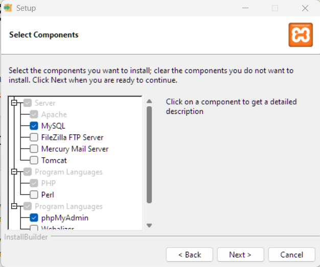

# Web Sunucusu Nedir ?

Herhangi bir PHP yazabilmemiz için yerel geliştirme ortamını **(local development environment)** kurmuş olmamız gerekir. PHP çoğunlukla web sunucusunda çalıştığı için, bir web sunucusunun ne olduğunu ve nasıl çalıştığını bilmek iyi bir fikirdir.

Bir web sunucusundan bahseden biri, bir donanıma veya bir yazılıma ya da hem donanıma hem de yazılıma atıfta bulunmuş olabilir. Donanımdaki bir web sunucusu, yalnızca web sunucusu yazılımını, kaynak kodunu ve diğer bazı şeyleri depolayan bir bilgisayardır.

Bir web sunucusu, farklı protokoller kullanarak gelen istekleri işleyebilir.

Tipik olarak, tarayıcı tarafından web sayfalarını görüntülemek için kullanılan protokol olan HTTP protokolüdür. Bir web sunucusu, aynı kaynağı kullanarak aynı sunucuda tek veya birden çok web sitesini barındırabilir. Bu, tek bir web sunucusunun birden çok web sitesinde kaynakları tahsis edebildiği ve paylaşabildiği sanal bilgisayar (**virtual hosts**) tarafından yapılır.

Web sitesini ziyaret ettiğinizde, tarayıcı dosyayı sunucudan isteyecektir. Web sunucusu bu isteği işleyecek ve buna göre yanıt verecektir. Dosyayı bulamazsa, 404 durum koduyla yanıt verir. Herhangi bir web sitesini ziyaret ederek ve istekleri incelemek için geliştirici araçlarını açarak bunu fiilen görebiliriz.

# <a>Neden XAMPP </a>

En yaygın iki web sunucusu Apache ve NGINX'tir.

İkisinin de artıları ve eksileri vardır.

Hangisinin daha iyi olduğu veya hangisinin seçileceği konusunda çok fazla ayrıntıya girmeyeceğim çünkü sizi çok fazla bilgi ile boğmak istemiyorum.

Şimdilik Apache'yi kullanacağız çünkü bu videoda kuracağımız yazılımla birlikte geliyor.

PHP'yi yerel ortamınıza kurmanın birçok farklı yolu vardır. Hatta işletim sisteminize yüklemiş olabilirsiniz. PHP'yi manuel olarak yüklediyseniz, Apache veya NGINX gibi yerel bir sunucuya ihtiyacınız olacaktır. Bunu manuel olarak kendiniz yüklemeniz gerekir.

Daha sonra, bir veritabanına da ihtiyacınız olduğuna karar verirseniz, onu da yüklemeniz gerekir. 

Bu yeni başlayanlar için uygun görünmüyor.

**GIO** abimiz  eğitiminde XAMPP kuruyor ve eğitimine bununla devam edeceğini söylüyor ama kendisinin normalde  docker kullandığını ve bunun kurulumunu ilerleyen derslerde anlatacağını belirtiyor. XAMPP dört başı mamur şekilde gelsede bunun  karşılığında elinizden esnekliği alıyor. Kısaca bahsedelim. XAMPP’de aynı anda birden fazla PHP sürümünü kurmak, güncellemesini yapmak zordur ayrıca güvenlik sıkıntıları vardır. XAMPP'yi üretimde kullanmayacağınız için, yerel kurulumunuz ile üretiminiz arasında her zaman bir tür kopukluk farkları olur. 

Örneğin,

yerel makinemde çalışıyor, ancak üretimde çalışmıyor gibi sorunlara neden olabilir. XAMPP daha çok hobi projeleri için kullanılmaktadır. Kendinizi geliştirdikçe alternatiflere yönelebilirsiniz.

# <a>XAMPP Kurulumu</a>

XAMPP sitesine gidin indirin ve kurulumu yapın

Sadece ihtiyacımız olanları indirdin

Programı sonra da serveları çalıştırın.

Serverların çalışıp çalışmadığını kontrol edelim. Bunun için
Tarayıcımızda http://localhost/ adresine gidelim.

Şimdi XAMPP'den explorer diyelim ve kurulu dizine gidelim. Htdocs klasörü local hostta gördüğümüz sayfanın  dosyalarıdır. Htdocs klasörün içindeki her şeyi silelim. Eğer bu Klasörde index.php adında bir dosya olursa Localhostta doğrudan bu görüntülenir. Eğer böyle bir dosyamız yoksa o zaman hedefteki dosyaları ve dizinleri listeleyecektir.

