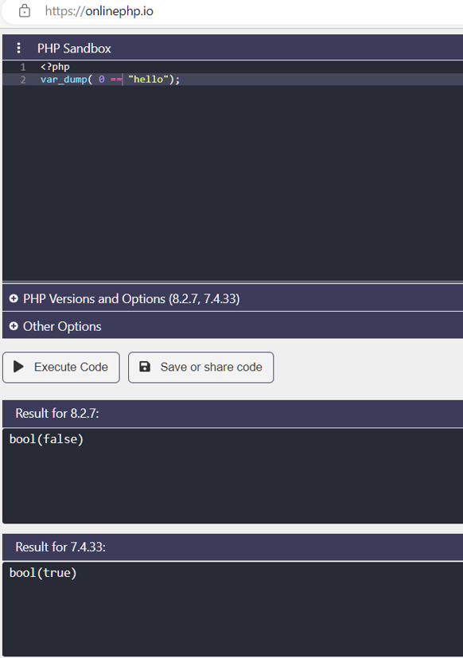

## Operators
- Eğer bir operatör tek bir değer(value) alabiliyorsa **"unary"**
- iki değer alabiliyorsa **(binary)**
- üç değer alabiliyorsa **(ternary)**
denir. PHP'de genel olarak operatorler binary'dir.

## Aritmatik(Arithmetic) Operatörler
 Aritmetik operatörler basit matematik işlemlerinden oluşur. Toplama, çıkarma bölme çarpma, mod alma gibi.
  ```
  <?php
$x =10;
$y=2;
var_dump($x+$y); //x+y=12
var_dump($x-$y); //x-y=8
var_dump($x*$y); //x*y=20
var_dump($x/$y); //x/y=5
var_dump($x%$y); //x in y'den bölümünden kalan = Mod = 0
var_dump($x**$y); // x'in y üssü = 10*10=100
  ```

#### operatör ile tip değişikliği
bir değişkene veya değere - yada + operatörleri ile kullanırsanız string kullanım olsanız bile bunları integere ya da float'a dönüştürmüş olursunuz.
Değer tam olarak bölünmüyorsa değer float'a çevrilir.
```
$x= '10';
$y= '3';
var_dump($x);
var_dump(+$x);
var_dump($x/$y);
```

değerlerden bir tanesi bile float ise sonuç float olur.
```
$x= '1.0';
$y= 1;
var_dump($x+$y);
```
#### 0'a bölmek
Bir sayıyı 0 a bölerseniz infinity olarak eror alırsınız.
eror almamak ve INF(infinity) değer almak için fdiv fonksiyonu kullan.
bölü işareti yerine "," kullanıyoruz.
```
$x= '1.0';
$y= 0;
var_dump(fdiv($x,$y));
```
#### Modlar
Modla işlem yaparken float'olarak kullandığın değerler integer değerine cast edilir.
```
$x= 10.5;
$y= 3.9;
var_dump($x%$y);
```

float değerler ile mod işlemi yapmak için fmod fonksiyonu kullanılır.
```
$x= 10.5;
$y= 3.9;
var_dump(fmod($x,$y));
```
mod için ilk yazılan değer pozitif ise sonuç pozitif negatif ise sonuç negatif olur.
```
$x= 10;
$z= -10;
$y= -3;
var_dump($x%$y);
var_dump($z%$y);
```
## Assingment(Atama) Operatorleri
#### "=" 
Sağdaki değeri soldaki değişkene atar.
5 değeri $x'e atanmıştır.
```
$x=5;
```
birden fazla değişkene atama ard arda yapılabilir.
```
$x = $y = 10;
var_dump($x,$y);
```
**Atama operatörleri ile aritmetik işlemlerin kısa yolları**
```
//"$x*= 3" bu ifadenin başka gösterimi "$x = $x*3"
//"$x+=3" bu ifadenin başka gösterimi "$x = $x+3"
//"$x-=3" bu ifadenin başka gösterimi "$x = $x-3"
//"$x/=3" bu ifadenin başka gösterimi "$x = $x/3"
//"$x%=3" bu ifadenin başka gösterimi "$x = $x%3"
//"$x**=3" bu ifadenin başka gösterimi "$x = $**3"
```
Örnek
```
$x = 5;
$x *= 3; 
var_dump($x); //çıktı: 15
```
####string operatorü ".="
normal "." ile sonradan ekleyeceğimize doğrudan string'e, string ekleme gerçekleştiriyor.

```
$x='Hello';
$x.=' World';
echo $x;
```
## Comparison Operatörleri
İki değeri birbiriyle karşılaştırmaya yararlar.

- **"=\="**  iki taraftaki değerin denk olup olmadığına bakar. denk ise true değerini döndürür. type conversion'u kendisi yapar.

- **"=\=\="** iki taraftaki değerin hem denkliğine hem de data tipine bakar. ikisi de aynı ise true döndürür.
```
$x=5;
$y='5';
var_dump($x==$y);//true
var_dump($x===$y);//false
```

- **"!=", "<>"** iki taraftaki değerin denk olup olmadığına bakar. denk değil ise true değerini döndürür. type conversion'u kendisi yapar.
- **"!=="** iki taraftaki değerin hem denkliğine hem de data tipine bakar. biri bile aynı değil ise true döndürür.
```
$x=5;
$y='5';
var_dump($x<>$y);// denk olduğu için false
var_dump($x!=$y);// denk olduğu için false
var_dump($x!==$y);// denk ama data tipi aynı olmaığı için true
```

#### "<" küçüktür, ">" büyüktür, "<=" küçük eşit, ">=" büyük eşit
```
$x=10;
$y=2;

var_dump($x < $y); //false
var_dump($x <= $y); // false
var_dump($x > $y); //true
var_dump($x >= $y); //true
```

#### <=> 'space ship comparison
- soldaki değer sağdakinden büyükse 1
- soldaki değer sağdakinde küçükse -1
- soldaki değer sağdakine eşitse 0 döner./
- int döndüğü unutulmamalı
```
$x=10;
$y=10;
var_dump($x<=>$y);
```

#### Önemli bir bilgi
"PHP 8"den önce bir int ile string'i karşılaştırdığınızda string'i integera çeviriyordu.Yani string(hello) önce int(0) olarak çevriliyor ve öyle karşılaştırma yapılıyordu.


PHP 8 den sonra artık int'i stringe çevirip öyle bir karşılaştırma yapıyor. yani int(0) önce string'0' a dönüşüyor ve karşılaştırma yapılıyor

```
<?php
var_dump(0 =="hello");
```




##strict comparison neden önemli
Aşağıdaki kodda **strpos** fonksiyonu, H'nin index numarasını döndürür ki bu int(0) a denk gelir. int"0" bool'a convert edilir ki bu da "false" olur. false, false'a denk olduğu için true değeri gelir ve H bulunumadı print edilir.
```
$x = 'Hello World';
$y = strpos($x,'H');
//strpos stringin içinde H harfini arar ve index'i integer olarak döndürür.
//integer(0) bool'a convert edilince false olur. ve 'H harfi bulunamadı' yazdırılır.

if($y == false){
    echo 'H harfi bulunamadı';
} else { 
    echo"H harfinin index'i ";
}
```
**Bir de bunu strict comparison ile deniyelim**
- int(0) convert edilmez. int(0), false'a eşit olmadığı için else'in içindeki kod çalışır.
```
$x = 'Hello World';
$y = strpos($x,'H');

if($y === false){
    echo 'H harfi bulunamadı';
} else { 
    echo"H harfinin index'i ". $y;
}
```
## Conditional(koşullu) Operatorler

**"?:" trinary operatörü**
- ifade true dönerse "?" işaretinden sonrası çalışır.
- ifade false dönerse ":" işaretinden sonrası çalışır.
```
$x = 'Hello World';
$y = strpos($x,'H');
$result = $y===false ? 'H harfi bulunamadı': 'H index\'i ' .$y;
echo $result;
//"$y===false" ifadesi doğruysa $result = 'H harfi bulunamadı'
//"$y===false" ifadesi yanlışsa $result = 'H index\'i ' .$y

```
**"??" null coalescing operatörü**
- "??" ifadesinden önceki değer null ise ?? operatöründen sonra geleni yazdırır.
- "??" ifadesinden önceki değer null değil ise ?? operatöründen önce gelen ifade döndürülür.
```
//$x null olduğu için $y = 'merhaba'
$x = null;
$y = $x ?? 'Merhaba';
echo $y;
```
**tanımlanmamış bir değer null'dur**

```
//tanımlanmamış bir değer null olduğu için ?? operatöründen sonra gelen ifadeyi yazdırdı.
$y = $a ?? 'Merhaba';
echo $y;`
```

**ifade null değilse**
```
//$x null olmadığı için ?? operatöründenden önceki ifade $y'ye atanmış oldu. 
$x = 456;
$y = $x ?? 'Merhaba';
echo $y;
```
