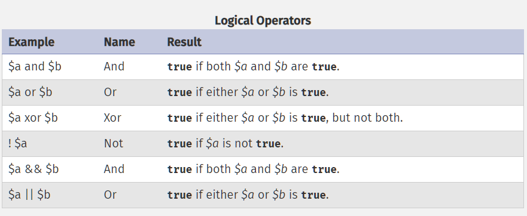

## "@" Error Control Operatörü
kullanılması önerilmez.
aşağıdai ifade eror verecek iken @ ile vermesi engellenir.
```
<?php
$x= @file('foo.txt);
```

##Increment(arttırma)/Decrement(azaltma) Operatörleri

#### Post Increment/Decrement
- \$x++ , \$x--
- işlem sırası şöyledir: önce değişken çağrılır ve değişkene 1 eklenir veya çıkartılır.
```
$x = 5;
echo $x++;//çıktı 5 olacaktır. $x değişkeni önce print edilmiş sonra 1 eklenmiştir.
echo $x; // çıktı 6 olacaktır çünkü $x'e yukarıda 1 eklenmiştir.
```
```
$x = 5;
echo $x--; // çıktı 5 olacaktır. $x değişkeni önce print edilmiş sonra 1 çıkartılmıştır.
echo $x; // çıktı 4 olacaktır çünkü $x'den yukarıda 1 çıkartılmıştır.
```
#### Pre(ön) Increment/Decrement 
- ++\$x, --\$x 
- 1'e veya -1'e değişken eklenir. 
```
$x=5;
echo ++$x;//çıktı 6 olacaktır çünkü 1'e $x değişkeni eklenmiştir.

$x=5;
echo --$x;//çıktı 4 olacaktır çünkü -1'e $x değişkeni eklenmiştir.
```
**Increment(++)/Decrement(--) operatörleri sadece sayıları ve stringleri etkiler.**
```
$x=true;
echo ++$x;//çıktı : 1 

$x=null; //null istisnadır.
echo ++$x;//çıktı: 1
```
**stringlerde**
```
$x='abc';
echo ++$x; çıktı: 'abd' 
//stringin son harfini alfabetik sıraya göre bir sonrakine yükseltti.
//Decrement operatörü string üzerinde bir etki yaratmaz.
```

## Logical(Mantıksal) Operatörler. (&&, ||, !, and, or, xor)

Mantıksal operatörler ile birden fazla koşulu bir araya getirebiliriz.

#### (&&) Ve, Operatörü
- iki koşulda true ise, true olarak değerlendirilir.
```
$x=true;
$y=false;

var_dump($x && $y);
```

PHP type conversion'u kendisi yaptığı için ille bool türünde değer girmeye gerek yoktur.
```
$x=1;
$y=1;

var_dump($x && $y);
```

#### (||) veya, operatörü
Koşullardan bir tanesinin bile true olması yeterlidir.
```
$x=1;
$y=0;
var_dump($x||$y);//true
```

#### (!) negotiation(anlaşma) operatörü
//binary bir operatör olan (!) değeri zıttına çeviri.
```
$x=1;
$y=0;

var_dump(!$x||$y);//false çıkar çünkü ! operatörü $x'i zıttına çevirir.
```
#### &&, ||, and , or
//her ne kadar && ile and aynı gibi dursa da aralarında **öncelik(precedence)** farkı vardır.
//her ne kadar "||" ile "or" aynı gibi dursa da aralarında **öncelik(precedence)** farkı vardır.
```
$x=true;
$y=false;
$z= $x && $y;// false çıkması beklenir ve çıkar.
var_dump($z);
```
Aşağıda **"="** operatörünün **and** operatörüne göre önceliği vardır. Öncelikle \$z değişkeni \$x değişkenine atanmış olur. Bu işlemden sonra **atama** işlemi gerçekleşmediği için $z true kalmaya devem eder. 
```
$x=true;
$y=false;
$z= $x and $y; 
var_dump($z);
```


## Short Circuting(Kısa devre)
Mantıksal operatör bir kısım değerlendirme yaptıktak sonra başka bir değerlendirmeye gerek kalmadığı için geri kalanları değerlendirmeyi bırakmasına kısa devre denir.

- Aşağıda \$y değişkeni değerlendirilmez çünkü || operatörü için 1 tane true değerinin olması yeterlidir.
```
$x=true;
$y=false;
$z= $x || $y; 
```
- örneklere bakalım
```
$x=true;
$y=false;
function hello(){
    echo 'hello';
    return false;
}
var_dump($x || hello()); // $x true olduğı için "hello()" fonksiyonu değerlendirilmesine gerek kalmadı çünkü || operatörü için bir tane true değeri yeterli.

//şimdi hello fonksiyonunu öne koyalım bakalım
var_dump( hello() ||$x); // hello fonksiyonu değerlendirildi ve hello'da print edildi.
//hello() fonksiyonu false olduğu için $x değişkeni de değerlendirildi ve true olduğu için sonuç true oldu.

```
## Bitwise Operatörleri(&, |, ^, ~, <<, >>)
Binary işlem yapmaya yarar. sanki ışıkları açıp kapatıyor gibi düşünelim.
Bitwise işlemlerle kriptolama işlemleri, bilgi saklama işlemleri yapılabilir. bu konulara ilerleyen derslerde girilecektir.

#### (&) = && işleminin aynısıdır sadece rakamları önce binary formata dönüştürür ve işlem yapar.
```
$x= 6;  //binary hali :110
        //            :&
$y= 3;  //binary hali :011
        //            :-----
        //1 ve 0 =     0
        //1 ve 1 =      1
        //0 ve 1 =       0
        //Sonuç  =    :010 bu binary'i decimal'e çevirisek sonuç 2 olur
var_dump($x & $y);
```
#### (|) = || işleminin aynısıdır sadece rakamları önce binary formata dönüştürür ve işlem yapar.
```
$x=6;
$y=3;
// 110
// |
// 011
// -----
// 111 =7
var_dump($x |$y);
```

#### (^)= xor (xor dediğimizde iki değerden sadece 1 tanesi doğruysa doğru yazdırmasıdır. İki değer de true ise false olarak değerlendirir.)
```
$x=6;
$y=3;
// 110
// ^
// 011
// -----
// 101 =5
var_dump($x^$y);
```
####(~) = ! zıttını alır.
```
$x=6;
$y=3;
// 110
// ~ operatörü 1 leri 0, 0'ları 1 yapar.
// 001
// &
// 011
// -----
// 001 =1
var_dump(~$x&$y);
```
#### (<<) bitleri sola kayıdır ve  ekler. bitleri sola kaydırmak sayıyı iki ile çarpma sonucunu doğurur.
#### (>>) bitleri sağa kayıdır. bitleri sola kaydırmak sayıyı iki ile bölme sonucunu doğurur.
```
$x=6;
$y=3;
// 110
// <<("y" üç olduğu için 3 tane 0 ekledik)
// 110000=48
var_dump($x<<$y);//$x deki bitleri $y değeri kadar sola kaydırır.
```
## Array operatörleri(+, == , =\=\=, !=,<>, !==)
#### (+) array operatörü
// Arraylerdeki indexleri aynı olmayan elemanları birleştiri.
```
$x=['a','b','c'];
$y=['d','e','f','g'];
$z = $x + $y;
print_r($z);// bir tek "g" eklendi çünkü diğerlerinin indexleri aynı idi.
```

#### (==) loose comparison array operatörü
- İki array'de de  indexler aynı ve Değerler aynı ise true olarak değer döndürür.
- Değerlerin aynı data tipinde olmasına veya sıralamaların aynı olmasına gerek yoktur.

```
$x=['a' => 1,'b' =>'2','c' =>'3'];
$y=['a' => '1','c' =>'3','b' =>'2'];

 var_dump($x==$y);
```

#### (===) strict comparison array operatörü
İki array'de de:
- İndexler aynı 
- Değerler aynı
- değerlerin data tipleri aynı
- ve indexlerin sıralamalarının da aynı
olması halinde true döndürür.
```

$x=['a' => '1','b' =>'2','c' =>'3'];
$y=['a' => '1','b' =>'2','c' =>'3'];

 var_dump($x===$y);
``` 
#### != , !== aynı şekilde 

##Execution operatörleri(``): 
bunu kullanacak yer pek de  yokmuş
## Type Operatörleri:
sonra görücez
## Nullsade Operatörleri:
sonra görücez