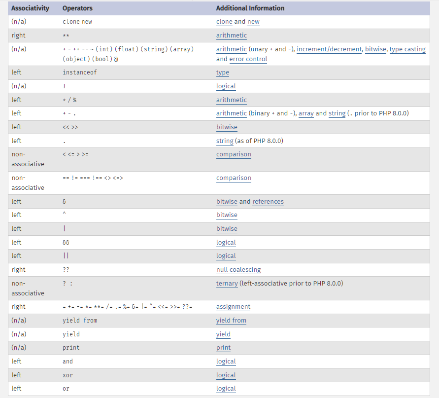

# Operatör Precedence (öncelikleri) ve Associativitiy(ilişkileri)

Matematikte nasıl çarpma işleminin, toplamaya ve çıkarmaya önceliği varsa PHP'de de bazı işlemlerin diğerlerine önceliği vardır ve önce bu işlemler gerçekleşir.
```
<?php
$x= 3+5*2;
echo $x;
//çarpım operatörü öncelikli olduğu için
//5*2=10
//10+3= "13" sonucu çıktı.
```
- Parantez işaretiyle öncelik belirtilebilir
```
$x= (3+5)*2;
echo $x;
//
//3+5=8
//8*2= "16" sonucu çıktı.
``` 


Bazı operatörlerin ise (Precedence) öncelikleri aynıdır. Örneğin (*) çarpma işlemi ile (/) bölme işlemi aynı önceliğe sahiptirler. bu durumda associativiy(ilişki) göz önüne alınır. çarpma ve bölme işleminde associativiy soldan başlar yani önce yazılan işlem gerçekleşir.
```
$x=8/2*4;
echo$x;

/*
sol taraftan işlemler yapılmaya başlanır.
8/2=4
4*4=16
*/
```
##  precedence ve associativity tablosu

- Yukarıdan aşağı doğru öncelik sırasıdır. Yukarıda olan önceliklidir.
- Associativity (left) yazıyorsa soldan, (right) yazıyorsa sağdan işlem yapmaya başlanır.
- non-associativity yazıyorsa bu işlemler yan yana kullanılamaz.

**Örnekler:**
```
$x=true;
$y=false;
$z= $x and $y;

var_dump($z);
//"=", "and"  operatörüne göre önceliklikli olduğu için önce = operatörü gerçekleşir.
// değişken $x, değişken $z'ye atanır ve  başka atama işlemi gerçekleşmediği için $z "true" değerini alır. 
// işlemin tamamını var_dump edersen "and" operatörünün de çalıştığını görürürüz.
var_dump($z= $x and $y);

```

Bu konuyla alakalı bütün bilgilere [buradan](https://www.php.net/manual/en/language.operators.precedence.php) ulaşabilirsiniz.