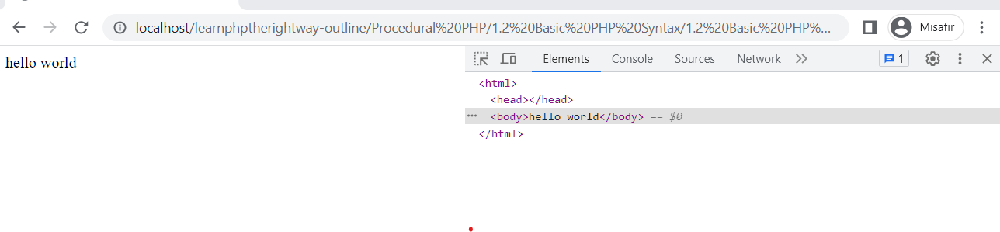

# <a></a> 1.2 Basit PHP sözdizimleri(Syntax)
Öncelikle htdocs klasörünün içine .php uzantılı bir dosya oluşturalım ve kod editörümüzle açalım. PHP uzantılı dosyalar içinde java script,css ve html içerebilir. kodumuzun PHP olarak yorumlanması için uzantının .php olması zorunludur. Syntax, namı diğer "Sözdizimi", bir programlama dilinde kullanılan kurallar ve yapılar kümesini ifade eder.


###Açılış ve Kapanış tag(etiket)leri
PHP kodumuz ancak aşağıdaki açılış ve kapanış etiketi **(tag)** içerisindeyse PHP olarak yorumlanır **(interpreted)**.

Kodumuzun içinde PHP'den başka bir dil de mevcutsa etiketleri böyle kullanmak zorunludur.
```
<?php         
    //kodumuz buraya yazılmalı
?>
```
Kodumuz sadece PHP'den meydana gelmekteyse "?>" kapanış tagini kullanmaya gerek yoktur.
Hatta kapanış tagi kullanmamak faydalıdır.
Aksi takdirde kodumuzda istenmeyen satırlar meydana gelebilir.
```
<?php
    //kodumuzu buraya yazıyoruz
```
###Echo
echo metin **(text)** veya değişkenlerin **(variables)** çıktısını **(outputting)** almak için kullanılır.
echo, çıktı **(output)** oluşturmak ve kullanıcıya bilgiyi görüntülemek için basit ama güçlü bir ifadedir.
```
<?php
echo 'hello mom';
    //Bu kodun çalışıp çalışmadığını görmek için xampp'ten serverları çalıştırın
     ve tarayıcınızda  (http://localhost/) adresine gidin
```

Burada öğrenilecek üç şey vardır.
PHP yazarken satır sonlarına ";" koymayı unutmayın yoksa Parse error alırsınız. Ancak kodunuzun son satırıysa ve siz "?>" kapanış etiketi kullandıysanız ";" olmasa bile kodunuz çalışır. Bunu HTML yazarken bir satır php ekleyecekseniz kullanabilirsiniz.
Kodunuzu tarayıcıda incelerseniz PHP kodunuzu göremezsiniz. bunun nedeni PHP'nin **server side language** olması yani işlemlerin serverda gerçekleşmesidir.
Üçüncüsü ise yazdırmak istediğimiz ifadeyi tek tırnak ' veya çift tırnak " işareti içine almamızdır. bu şekilde ifadenin **String** olduğunu belirtmiş oluruz.


###print vs echo

echo ile birden çok parametre "," ile ayrılarak (separated) kulanılabilir ve .
print ise bir fonksiyon olduğundan sadece bir parametre kabul eder ve daha çok parantez içinde kullanılır.
```
<?php 
print ('hello mom');
//veya
print 'hello mom';
```
print  değeri "1" olarak geri döndürür **(value return)**. Bunu görmek için şöyle bir kod yazalım
```
<?php
echo print 'hello mom';
```

printle değer "1" olarak dönerken echo'da  herhangi bir değer dönmez (**void return**).
print ifadelerle **(expressions)** kullanılabilir. echo kullanılamaz. 
*yani // print echo 'hello mom'; gibi bir ifade hata verir. Oysa echo print 'hello mom';  ifadesi çalışır*
echo, print ifadesine göre daha performanslıdır. print kullanmak için özel bir sebebiniz yoksa echo kullanın.

```
<?php
echo 'Hello','?','mom';
//bu kod ile 3 farklı argüman ","ile bir birine zincirlenmiştir(concatenation).
```

print ile "," kulanarak bir zincirleme yapamazsınız.

### Kaçınma karakteri "/"

```
<?php
echo 'ali'nin derdi';
//Bu şekilde kesme işareti kullanırsanız hata ile karşılaşırsınız.
Kesme işareti kullanmak için kesme işaretinden önce ters slash kullanılır.
echo 'ali\'nin derdi';
yada
echo "ali'nin derdi";
//ifadesini de kullanabilirsiniz.
```

### Değişkenler

Adını kendimiz koyduğumuz değişkenlere bir atama yapılmasını sağlar.tanımlamayı \"\$" işareti ile yaparız. PHP'de değişken tanımlarken uymamız gerek bazı kurallar vardır. \"\$" işartinden sonra doğrudan bir rakam gelemez ancak "$_1" şeklinde olabilir. tanımda "@#½" gibi özel karakterler olamaz.
son olarak \"\$this" tanımlaması yapamazsın çünkü bu ifade objelere göndermedir(sonra bu konu hakkında konuşacağız).

```
<?php
$_1Ad = 'aibrahimkcc';
echo $_1Ad;
//bu kod  "aibrahimkcc" yazdırır.
```

### Değere göre atama (assining by value) ile referansa(assining by referance) göre atama arasındaki fark

Değer atama, bir değişkenin değerinin kopyalanarak başka bir değişkene atanması anlamına gelir.
İki değişken bağımsızdır ve bir değişkeni değiştirmek diğerini etkilemez.
Değer atama genellikle tamsayılar, kayan nokta sayıları, booleanlar ve metin gibi ilkel veri tipleri için kullanılır.

```
$a = 10;
$b = $a; // $b'ye $a'nın değerini atar. (bir kopyası)
$a = 20; // $a'yı değiştirmek, $b'yi etkilemez
echo $b; // Çıktı: 10 olacaktır.

```

Referans Atama:
Referans atama, bir değişkenin başka bir değişkene atanması anlamına gelir, ancak her iki değişken de aynı bellek konumuna veya nesneye işaret eder.
Bir değişkende yapılan herhangi bir değişiklik, diğerini etkiler çünkü aslında aynı veri için birbirine bağlantılıdır.
Referans atama, genellikle diziler ve nesneler gibi karmaşık veri tipleri için kullanılır.

```
$a = 1;
$b = &$a; // "&$"ifadesiyle referans atama gerçekleşir
$a = 5; // $a'yı değiştirmek, $b'yi etkiler
echo $b // Çıktı: 5
```


